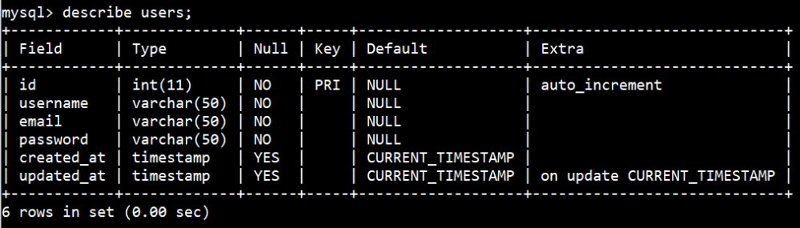
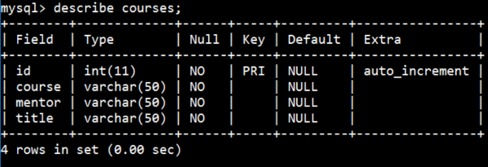
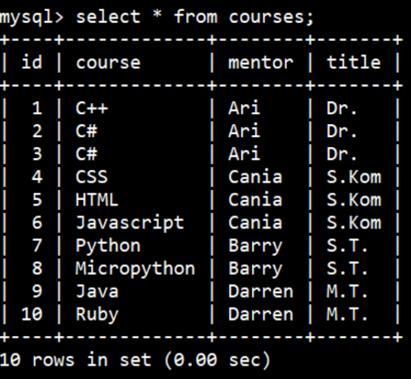
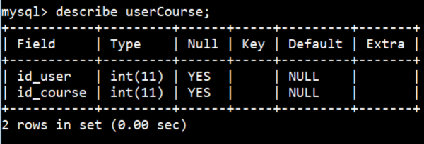
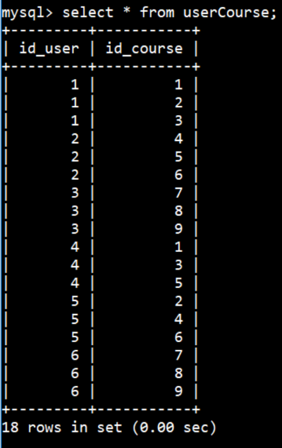
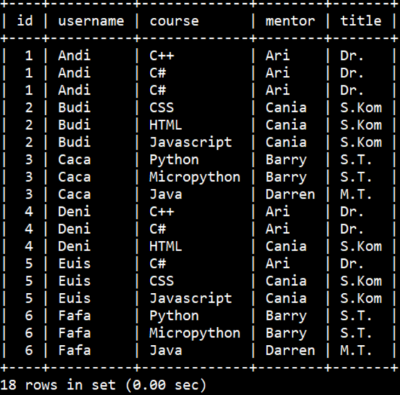
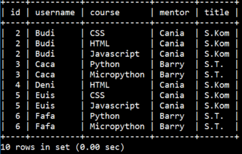
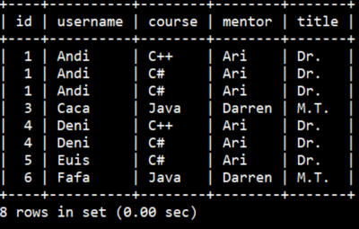
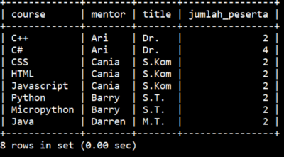
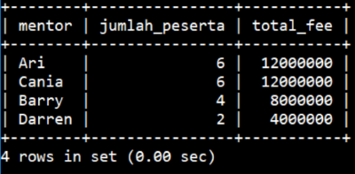

# Soal Latihan MySQL


#

### **Soal 1 - MySQL World Database**

MySQL secara default menyertakan database ```world``` yang dapat digunakan oleh user untuk mempelajari teknik penggunaan database di MySQL. Database ```world``` merupakan sample real database yang bersumber dari [Statistics Finland](https://www.stat.fi/index_en.html) dan dirilis sekitar awal tahun 2000-an. Database ini berisi 3 buah tabel yang saling berhubungan satu sama lain:

- Tabel ```city``` berisi informasi tentang __4079__ kota di dunia.
- Tabel ```country``` berisi informasi tentang __239__ negara/wilayah yang dianggap sebagai negara di dunia.
- Tabel ```countrylanguage``` berisi informasi tentang bahasa yang digunakan oleh negara-negara di dunia.

*__Soal :__* Aktifkan server MySQL Anda, lalu gunakan database ```world``` dan tuliskan langkah-langkah/query MySQL untuk menyelesaikan perintah di bawah. Anda dilarang membuat database baru, menambah table/data, membuat view atau segala bentuk tindakan yang mengubah struktur database.

1. Tampilkan daftar __10 kota terpadat di Indonesia__. Urutkan data dari kota dengan populasi terbanyak. Kolom yang diwajibkan tampil adalah __id kota__, __nama kota__, __kode negara__, __distrik/provinsi__ dan __populasi__. Output yang diharapkan:

    ```bash
    +-----+----------------+-------------+------------------+------------+
    | ID  | Name           | CountryCode | District         | Population |
    +-----+----------------+-------------+------------------+------------+
    | 939 | Jakarta        | IDN         | Jakarta Raya     |    9604900 |
    | 940 | Surabaya       | IDN         | East Java        |    2663820 |
    | 941 | Bandung        | IDN         | West Java        |    2429000 |
    | 942 | Medan          | IDN         | Sumatera Utara   |    1843919 |
    | 943 | Palembang      | IDN         | Sumatera Selatan |    1222764 |
    | 944 | Tangerang      | IDN         | West Java        |    1198300 |
    | 945 | Semarang       | IDN         | Central Java     |    1104405 |
    | 946 | Ujung Pandang  | IDN         | Sulawesi Selatan |    1060257 |
    | 947 | Malang         | IDN         | East Java        |     716862 |
    | 948 | Bandar Lampung | IDN         | Lampung          |     680332 |
    +-----+----------------+-------------+------------------+------------+
    ```

2. Tampilkan daftar __10 kota terpadat di dunia beserta asal negaranya__. Urutkan data dari kota dengan populasi terbanyak. Kolom yang diwajibkan ada minimal adalah __id kota__, __nama kota__, __distrik/provinsi__, __nama negara__ dan __populasi__. Output yang diharapkan:

    ```bash
    +------+-------------------+------------------+--------------------+------------+
    | id   | nama_kota         | district         | negara             | population |
    +------+-------------------+------------------+--------------------+------------+
    | 1024 | Mumbai (Bombay)   | Maharashtra      | India              |   10500000 |
    | 2331 | Seoul             | Seoul            | South Korea        |    9981619 |
    |  206 | São Paulo        | São Paulo       | Brazil             |    9968485 |
    | 1890 | Shanghai          | Shanghai         | China              |    9696300 |
    |  939 | Jakarta           | Jakarta Raya     | Indonesia          |    9604900 |
    | 2822 | Karachi           | Sindh            | Pakistan           |    9269265 |
    | 3357 | Istanbul          | Istanbul         | Turkey             |    8787958 |
    | 2515 | Ciudad de México | Distrito Federal | Mexico             |    8591309 |
    | 3580 | Moscow            | Moscow (City)    | Russian Federation |    8389200 |
    | 3793 | New York          | New York         | United States      |    8008278 |
    +------+-------------------+------------------+--------------------+------------+
    ```

3. Tampilkan daftar __10 negara yang tercatat merdeka paling awal__. Daftar negara yang tidak diketahui tahun kemerdekaannya, tidak perlu diikutsertakan. Kolom yang diwajibkan ada minimal adalah __kode negara__, __nama negara__, __benua__, __regional__ dan __tahun merdeka (*Independence Year*)__. Output yang diharapkan:

    ```bash
    +------+----------------+-----------+------------------+---------------+
    | code | name           | continent | region           | tahun_merdeka |
    +------+----------------+-----------+------------------+---------------+
    | CHN  | China          | Asia      | Eastern Asia     |         -1523 |
    | ETH  | Ethiopia       | Africa    | Eastern Africa   |         -1000 |
    | JPN  | Japan          | Asia      | Eastern Asia     |          -660 |
    | DNK  | Denmark        | Europe    | Nordic Countries |           800 |
    | SWE  | Sweden         | Europe    | Nordic Countries |           836 |
    | FRA  | France         | Europe    | Western Europe   |           843 |
    | SMR  | San Marino     | Europe    | Southern Europe  |           885 |
    | GBR  | United Kingdom | Europe    | British Islands  |          1066 |
    | PRT  | Portugal       | Europe    | Southern Europe  |          1143 |
    | AND  | Andorra        | Europe    | Southern Europe  |          1278 |
    +------+----------------+-----------+------------------+---------------+
    ```

4. Tampilkan daftar __benua yang memiliki lebih dari 10 negara di dalamnya__. Kolom yang ditampilkan minimal: __nama benua__, __jumlah negara di dalam benua__, __total populasi__ dan __rata-rata angka harapan hidup (*Life Expectancy*)__ kemudian urutkan dari benua yang memiliki populasi terbanyak. Output yang diharapkan:

    ```bash
    +---------------+---------------+------------+-------------------+
    | Benua         | Jumlah_Negara | Populasi   | Rata_AngkaHrpnHdp |
    +---------------+---------------+------------+-------------------+
    | Asia          |            51 | 3705025700 |          67.44118 |
    | Africa        |            58 |  784475000 |          52.57193 |
    | Europe        |            46 |  730074600 |          75.14773 |
    | North America |            37 |  482993000 |          72.99189 |
    | South America |            14 |  345780000 |          70.94615 |
    | Oceania       |            28 |   30401150 |          69.71500 |
    +---------------+---------------+------------+-------------------+
    ```

5. Tampilkan daftar __negara-negara Asia yang memiliki angka harapan hidup lebih dari rata-rata angka harapan hidup negara-negara Eropa__. Kolom yang diwajibkan ada yaitu __nama negara__, __nama benua__, __angka harapan hidup__ dan **Pendapatan Nasional Bruto/GNP (_Gross National Product_)**. Urutkan data dari negara Asia dengan angka harapan hidup tertinggi. Output yang diharapkan:

    ```bash
    +-----------+-------+-------------------+------------+
    | Nama      | Benua | AngkaHarapanHidup | GNP        |
    +-----------+-------+-------------------+------------+
    | Macao     | Asia  |              81.6 |    5749.00 |
    | Japan     | Asia  |              80.7 | 3787042.00 |
    | Singapore | Asia  |              80.1 |   86503.00 |
    | Hong Kong | Asia  |              79.5 |  166448.00 |
    | Israel    | Asia  |              78.6 |   97477.00 |
    | Jordan    | Asia  |              77.4 |    7526.00 |
    | Cyprus    | Asia  |              76.7 |    9333.00 |
    | Taiwan    | Asia  |              76.4 |  256254.00 |
    | Kuwait    | Asia  |              76.1 |   27037.00 |
    +-----------+-------+-------------------+------------+
    ```

6. Tampilkan daftar __10 negara yang bahasa resminya (_official language_) adalah bahasa Inggris, dan memiliki persentase pengguna bahasa Inggris tertinggi di dunia__. Kolom yang diwajibkan ada yaitu __kode negara__, __nama negara__, __bahasa__, __kolom isOfficial__ dan __percentage__. Urutkan dari persentase pengguna bahasa Inggris tertinggi. Output yang diharapkan:

    ```bash
    +-------------+----------------------+----------+------------+------------+
    | countrycode | name                 | language | isOfficial | percentage |
    +-------------+----------------------+----------+------------+------------+
    | BMU         | Bermuda              | English  | T          |      100.0 |
    | IRL         | Ireland              | English  | T          |       98.4 |
    | GBR         | United Kingdom       | English  | T          |       97.3 |
    | GIB         | Gibraltar            | English  | T          |       88.9 |
    | NZL         | New Zealand          | English  | T          |       87.0 |
    | USA         | United States        | English  | T          |       86.2 |
    | VIR         | Virgin Islands, U.S. | English  | T          |       81.7 |
    | AUS         | Australia            | English  | T          |       81.2 |
    | CAN         | Canada               | English  | T          |       60.4 |
    | BLZ         | Belize               | English  | T          |       50.8 |
    +-------------+----------------------+----------+------------+------------+
    ```

7. Tampilkan daftar __negara ASEAN beserta populasi negaranya, Pendapatan Nasional Bruto/GNP (_Gross National Product_), ibukota & populasi ibukota__. ASEAN (_Association of Southeast Asian Nations_) merupakan sebuah organisasi geo-politik dan ekonomi dari negara-negara di kawasan Asia Tenggara, yang didirikan di Bangkok, 8 Agustus 1967 dengan tujuan untuk meningkatkan pertumbuhan ekonomi, kemajuan sosial, pengembangan kebudayaan negara-negara anggotanya, serta memajukan perdamaian dan stabilitas di tingkat regional. Negara Asia Tenggara yang terdaftar sebagai anggota ASEAN adalah: 

    -  Brunei
    -  Cambodia
    -  East Timor
    -  Indonesia
    -  Laos
    -  Malaysia
    -  Myanmar
    -  Philippines
    -  Singapore 
    -  Thailand
    -  Vietnam
    
    Tampilkan daftar __negara ASEAN beserta populasi negaranya, Pendapatan Nasional Bruto/GNP (_Gross National Product_), ibukota & populasi ibukota__, dengan kolom yang diwajibkan ada yaitu __nama negara__, __populasi negara__, __pendapatan nasional bruto (GNP)__, __nama ibukota__ dan __populasi ibukota__. Urutkan berdasarkan abjad nama negara. Output yang diharapkan:

    ```bash
    +--------------+-----------------+-----------+---------------------+------------------+
    | Negara_ASEAN | Populasi_Negara | GNP       | Ibukota             | Populasi_Ibukota |
    +--------------+-----------------+-----------+---------------------+------------------+
    | Brunei       |          328000 |  11705.00 | Bandar Seri Begawan |            21484 |
    | Cambodia     |        11168000 |   5121.00 | Phnom Penh          |           570155 |
    | East Timor   |          885000 |      0.00 | Dili                |            47900 |
    | Indonesia    |       212107000 |  84982.00 | Jakarta             |          9604900 |
    | Laos         |         5433000 |   1292.00 | Vientiane           |           531800 |
    | Malaysia     |        22244000 |  69213.00 | Kuala Lumpur        |          1297526 |
    | Myanmar      |        45611000 | 180375.00 | Rangoon (Yangon)    |          3361700 |
    | Philippines  |        75967000 |  65107.00 | Manila              |          1581082 |
    | Singapore    |         3567000 |  86503.00 | Singapore           |          4017733 |
    | Thailand     |        61399000 | 116416.00 | Bangkok             |          6320174 |
    | Vietnam      |        79832000 |  21929.00 | Hanoi               |          1410000 |
    +--------------+-----------------+-----------+---------------------+------------------+
    ```

8. Tampilkan daftar __negara G20 beserta populasi negaranya, Pendapatan Nasional Bruto/GNP (_Gross National Product_), ibukota & populasi ibukota__. G20 merupakan kelompok 19 negara dengan perekonomian besar di dunia, ditambah dengan Uni Eropa, yang dibentuk sejak 1999 sebagai forum untuk mendiskusikan berbagai masalah kunci di bidang ekonomi dunia. Negara yang terdaftar sebagai anggota G20 adalah: 

    -  Argentina 
    -  Australia 
    -  Brazil 
    -  Canada 
    -  China 
    -  France 
    -  Germany 
    -  India 
    -  Indonesia 
    -  Italia 
    -  Japan 
    -  Mexico 
    -  Russian Federation 
    -  Saudi Arabia 
    -  South Africa 
    -  South Korea 
    -  Turkey
    -  United Kingdom 
    -  United States
    
    Tampilkan daftar __negara G20 beserta populasi negaranya, Pendapatan Nasional Bruto/GNP (_Gross National Product_), ibukota & populasi ibukota__, dengan kolom yang diwajibkan ada yaitu __nama negara__, __populasi negara__, __pendapatan nasional bruto (GNP)__, __nama ibukota__ dan __populasi ibukota__. Urutkan berdasarkan abjad nama negara. Output yang diharapkan:

    ```bash
    +--------------------+-----------------+------------+-------------------+------------------+
    | Negara_G20         | Populasi_Negara | GNP        | Ibukota           | Populasi_Ibukota |
    +--------------------+-----------------+------------+-------------------+------------------+
    | Argentina          |        37032000 |  340238.00 | Buenos Aires      |          2982146 |
    | Australia          |        18886000 |  351182.00 | Canberra          |           322723 |
    | Brazil             |       170115000 |  776739.00 | Brasília          |          1969868 |
    | Canada             |        31147000 |  598862.00 | Ottawa            |           335277 |
    | China              |      1277558000 |  982268.00 | Peking            |          7472000 |
    | France             |        59225700 | 1424285.00 | Paris             |          2125246 |
    | Germany            |        82164700 | 2133367.00 | Berlin            |          3386667 |
    | India              |      1013662000 |  447114.00 | New Delhi         |           301297 |
    | Indonesia          |       212107000 |   84982.00 | Jakarta           |          9604900 |
    | Japan              |       126714000 | 3787042.00 | Tokyo             |          7980230 |
    | Mexico             |        98881000 |  414972.00 | Ciudad de México |          8591309 |
    | Russian Federation |       146934000 |  276608.00 | Moscow            |          8389200 |
    | Saudi Arabia       |        21607000 |  137635.00 | Riyadh            |          3324000 |
    | South Africa       |        40377000 |  116729.00 | Pretoria          |           658630 |
    | South Korea        |        46844000 |  320749.00 | Seoul             |          9981619 |
    | Turkey             |        66591000 |  210721.00 | Ankara            |          3038159 |
    | United Kingdom     |        59623400 | 1378330.00 | London            |          7285000 |
    | United States      |       278357000 | 8510700.00 | Washington        |           572059 |
    +--------------------+-----------------+------------+-------------------+------------------+
    ```

    ✅ Lampiran jawaban berupa daftar query MySQL dalam bentuk file world.txt yang sudah diupload

#

### **Soal 2 - 💃 Panggung Sandiwara**

MySQL secara default menyertakan database ```sakila``` yang dapat digunakan oleh user untuk mempelajari teknik penggunaan database di MySQL. Database ```sakila``` merupakan sample dummy database yang menyimpan informasi seputar toko rental DVD.

*__Soal :__* Aktifkan server MySQL Anda, lalu gunakan database ```sakila``` dan tuliskan langkah-langkah/query MySQL untuk menyelesaikan perintah berikut. Anda dilarang membuat database baru, merubah struktur table, membuat view atau segala bentuk tindakan yang mengubah struktur database.

1. Tampilkan daftar __10 film komedi dengan durasi tersingkat__. Urutkan data berdasarkan film dengan durasi terpendek. Kolom yang diwajibkan tampil adalah __title__, __category__ dan __length__. Output yang diharapkan:

    ```bash
    +------------------+----------+--------+
    | title            | category | length |
    +------------------+----------+--------+
    | DOWNHILL ENOUGH  | Comedy   |     47 |
    | HEAVEN FREEDOM   | Comedy   |     48 |
    | PARADISE SABRINA | Comedy   |     48 |
    | HURRICANE AFFAIR | Comedy   |     49 |
    | LION UNCUT       | Comedy   |     50 |
    | ZORRO ARK        | Comedy   |     50 |
    | CLOSER BANG      | Comedy   |     58 |
    | AIRPLANE SIERRA  | Comedy   |     62 |
    | LONELY ELEPHANT  | Comedy   |     67 |
    | DOOM DANCING     | Comedy   |     68 |
    +------------------+----------+--------+
    ```

2. Tampilkan daftar lengkap __kategori film beserta jumlah film tiap kategori & rata-rata harga sewa DVD film tiap kategori__. Urutkan data dari kategori dengan jumlah film terbanyak. Kolom yang diwajibkan ada minimal adalah __kategori__, __jumlah film__ dan __rata-rata harga sewa__. Output yang diharapkan:

    ```bash
    +-------------+-------------+---------------+
    | kategori    | jumlahMovie | rataHargaSewa |
    +-------------+-------------+---------------+
    | Foreign     |          73 |      3.099589 |
    | Sports      |          73 |      3.099589 |
    | Family      |          69 |      2.758116 |
    | Documentary |          68 |      2.666471 |
    | Animation   |          66 |      2.808182 |
    | Action      |          64 |      2.646250 |
    | New         |          63 |      3.116984 |
    | Drama       |          61 |      2.990000 |
    | Games       |          61 |      3.252295 |
    | Sci-Fi      |          61 |      3.219508 |
    | Children    |          60 |      2.890000 |
    | Comedy      |          58 |      3.162414 |
    | Classics    |          57 |      2.744386 |
    | Horror      |          56 |      3.025714 |
    | Travel      |          56 |      3.275714 |
    | Music       |          51 |      2.950784 |
    +-------------+-------------+---------------+
    ```

3. [Motion Picture Association of America](https://en.wikipedia.org/wiki/Motion_Picture_Association_of_America_film_rating_system) memiliki sistem rating untuk film berdasarkan konten & target penontonnya dengan klasifikasi sebagai berikut:

    - **G** : General Audiences
    - **PG** : Parental Guidance Suggested
    - **PG-13** : Parental Guidances for Children Under 13
    - **R** : Restricted
    - **NC-17** : No Children Under 17 Admitted

    Tampilkan daftar lengkap __rating film beserta keterangan arti rating & jumlah film tiap rating__. Kolom yang diwajibkan ada minimal adalah __rating__, __keterangan rating__ dan __jumlah film__. Output yang diharapkan:

    ```bash
    +--------+---------------------------------+--------------+
    | rating | keterangan                      | jumlahMovie  |
    +--------+---------------------------------+--------------+
    | G      | General Audiences               |          178 |
    | PG     | Parental Guidance Suggested     |          194 |
    | PG-13  | Parental Guidances for Under 13 |          223 |
    | R      | Restricted                      |          195 |
    | NC-17  | No Children Under 17 Admitted   |          210 |
    +--------+---------------------------------+--------------+
    ```

4. Tampilkan daftar __10 aktor/aktris yang paling banyak membintangi film__. Kolom yang ditampilkan minimal: __id aktor__, __nama depan__, __nama belakang__ dan __jumlah film yang dibintangi__ kemudian urutkan dari aktor/aktris yang membintangi film terbanyak. Output yang diharapkan:

    ```bash
    +----------+------------+-------------+--------------+
    | actor_id | first_name | last_name   | jumlah_Movie |
    +----------+------------+-------------+--------------+
    |      107 | GINA       | DEGENERES   |           42 |
    |      102 | WALTER     | TORN        |           41 |
    |      198 | MARY       | KEITEL      |           40 |
    |      181 | MATTHEW    | CARREY      |           39 |
    |       23 | SANDRA     | KILMER      |           37 |
    |       81 | SCARLETT   | DAMON       |           36 |
    |      158 | VIVIEN     | BASINGER    |           35 |
    |      144 | ANGELA     | WITHERSPOON |           35 |
    |      106 | GROUCHO    | DUNST       |           35 |
    |       60 | HENRY      | BERRY       |           35 |
    +----------+------------+-------------+--------------+
    ```

5. Dari soal sebelumnya diketahui ```Gina Degeneres``` merupakan aktris yang paling banyak membintangi film, dengan total **42** judul film. Kategori film apakah yang paling banyak dibintanginya? Untuk mengetahuinya, tampilkan daftar __kategori film beserta jumlah film yang pernah dibintangi oleh ```Gina Degeneres```__. Kolom yang diwajibkan ada yaitu __kategori film__ dan __jumlah film yang dibintangi__. Output yang diharapkan:

    ```bash
    +-------------+--------------+
    | category    | jumlah_Movie |
    +-------------+--------------+
    | Documentary |            3 |
    | Foreign     |            2 |
    | Music       |            4 |
    | New         |            1 |
    | Sci-Fi      |            7 |
    | Action      |            3 |
    | Drama       |            2 |
    | Animation   |            4 |
    | Horror      |            1 |
    | Family      |            4 |
    | Comedy      |            3 |
    | Children    |            2 |
    | Classics    |            2 |
    | Sports      |            2 |
    | Games       |            1 |
    | Travel      |            1 |
    +-------------+--------------+
    ```

6. Dari soal sebelumnya diketahui ```Gina Degeneres``` paling banyak membintangi film bergenre science-fiction, dengan total **7** judul film. Tampilkan daftar __judul film sci-fi yang pernah dibintangi oleh ```Gina Degeneres```__. Kolom yang diwajibkan ada yaitu __judul film__ dan __kategorinya__. Output yang diharapkan:

    ```bash
    +---------------------+----------+
    | title               | category |
    +---------------------+----------+
    | CHARIOTS CONSPIRACY | Sci-Fi   |
    | COLDBLOODED DARLING | Sci-Fi   |
    | FRISCO FORREST      | Sci-Fi   |
    | GOODFELLAS SALUTE   | Sci-Fi   |
    | LICENSE WEEKEND     | Sci-Fi   |
    | OPEN AFRICAN        | Sci-Fi   |
    | SPIRITED CASUALTIES | Sci-Fi   |
    +---------------------+----------+
    ```

7. Tampilkan daftar __10 aktor/aktris yang paling banyak membintangi film horror__. Kolom yang ditampilkan minimal: __id aktor__, __nama depan__, __nama belakang__ dan __jumlah film horror yang dibintangi__ kemudian urutkan dari aktor/aktris yang membintangi film horror terbanyak. Output yang diharapkan:

    ```bash
    +----------+------------+-----------+--------------+
    | actor_id | first_name | last_name | jumlah_Movie |
    +----------+------------+-----------+--------------+
    |       27 | JULIA      | MCQUEEN   |            7 |
    |       42 | TOM        | MIRANDA   |            6 |
    |       60 | HENRY      | BERRY     |            5 |
    |       14 | VIVIEN     | BERGEN    |            5 |
    |       94 | KENNETH    | TORN      |            4 |
    |       75 | BURT       | POSEY     |            4 |
    |       54 | PENELOPE   | PINKETT   |            4 |
    |      102 | WALTER     | TORN      |            4 |
    |       12 | KARL       | BERRY     |            4 |
    |       40 | JOHNNY     | CAGE      |            4 |
    +----------+------------+-----------+--------------+
    ```

8. Dari soal sebelumnya diketahui ```Julia McQueen``` merupakan aktris yang paling banyak membintangi film horror, dengan total **7** judul film. Tampilkan daftar __judul film horror yang pernah dibintangi oleh ```Julia McQueen```__. Kolom yang diwajibkan ada yaitu __judul film__ dan __kategorinya__. Output yang diharapkan:

    ```bash
    +--------------------+----------+
    | title              | category |
    +--------------------+----------+
    | ARABIA DOGMA       | Horror   |
    | FREDDY STORM       | Horror   |
    | HIGH ENCINO        | Horror   |
    | MONTEREY LABYRINTH | Horror   |
    | SPIRIT FLINTSTONES | Horror   |
    | STRANGERS GRAFFITI | Horror   |
    | TRAIN BUNCH        | Horror   |
    +--------------------+----------+
    ```

    ✅ Lampiran jawaban berupa daftar query MySQL dalam bentuk file sakila.txt yang sudah diupload

#

### **Soal 3 - Distributor Die Cast 🚗**


Anda adalah distributor ternama di bidang jual-beli _die cast_ (miniatur moda transportasi) yang menjual beragam produk dari vendor-vendor berkualitas,
dengan 7 kantor cabang tersebar di beberapa negara dunia. Disediakan database
yang menyimpan berbagai data terkait usaha Anda, mulai dari daftar customer, karyawan, produk hingga transaksi yang dilakukan. 

Anda __dilarang keras__ mengubah struktur & format tabel serta database yang telah disediakan.

1. Rumuskan _single query_ untuk menampilkan jumlah __total customer__ yang Anda layani, beserta jumlah __total kota & negara asal__ customer-customer Anda. Contoh output yang diharapkan:

    ```bash
    +-----------+--------+-----------+
    | Customers | Cities | Countries |
    +-----------+--------+-----------+
    |       122 |     95 |        27 |
    +-----------+--------+-----------+
    ```

    Anda memiliki __122 customer__ dari __95 kota__ yang tersebar di __27 negara__!

2. Rumuskan _single query_ untuk menampilkan _resources_ yang Anda miliki, mulai dari jumlah __karyawan__, jumlah __kantor & lokasi negaranya__, jumlah __barang yang dijual__, total __stok barang__ & jumlah __vendor__ yang menjadi partner Anda. Contoh output yang diharapkan:

    ```bash
    +-----------+---------+---------+----------+---------------+---------+
    | Employees | Offices | Country | Products | StockProducts | Vendors |
    +-----------+---------+---------+----------+---------------+---------+
    |        23 |       7 |       5 |      110 |        555131 |      13 |
    +-----------+---------+---------+----------+---------------+---------+
    ```

    Anda memiliki __23 karyawan__ di __7 kantor__ yang berada di __5 negara__, dengan __110 model die cast__ (total stok mencapai __555131 item__) yang didistribusikan dari __13 vendor partner__.

3. Dari soal sebelumnya tercatat Anda memiliki __110 model die cast__ dengan total stok __555131 item__. Jika dikategorikan, produk yang Anda jual terbagi menjadi __7 product line__ _die cast_, yakni model mobil klasik, mobil _vintage_, sepeda motor, pesawat terbang, kapal laut, kereta api serta truk & bus. Rumuskan _single query_ yang dapat menampilkan __harga produk terendah & tertinggi__ untuk masing-masing kategori. Contoh output yang diharapkan:

    ```bash
    +------------------+----------+----------+
    | productLine      | minPrice | maxPrice |
    +------------------+----------+----------+
    | Classic Cars     |    15.91 |   103.42 |
    | Motorcycles      |    24.14 |    91.02 |
    | Planes           |    29.34 |    77.27 |
    | Ships            |    33.30 |    82.34 |
    | Trains           |    26.72 |    67.56 |
    | Trucks and Buses |    24.92 |    84.76 |
    | Vintage Cars     |    20.61 |    86.70 |
    +------------------+----------+----------+
    ```

4. Rumuskan _single query_ yang dapat menampilkan daftar 10 customer paling _royal_ (paling banyak mendatangkan uang bagi kita), yang total nominal transaksinya paling tinggi. Data yang ditampilkan adalah nama customer, kota & negara asal, beserta total uang yang dihabiskan di produk kita. Contoh output yang diharapkan:

    ```bash
    +------------------------------+---------------+-------------+-----------+
    | customerName                 | city          | country     | total     |
    +------------------------------+---------------+-------------+-----------+
    | Euro+ Shopping Channel       | Madrid        | Spain       | 715738.98 |
    | Mini Gifts Distributors Ltd. | San Rafael    | USA         | 584188.24 |
    | Australian Collectors, Co.   | Melbourne     | Australia   | 180585.07 |
    | Muscle Machine Inc           | NYC           | USA         | 177913.95 |
    | Dragon Souveniers, Ltd.      | Singapore     | Singapore   | 156251.03 |
    | Down Under Souveniers, Inc   | Auckland      | New Zealand | 154622.08 |
    | AV Stores, Co.               | Manchester    | UK          | 148410.09 |
    | Anna's Decorations, Ltd      | North Sydney  | Australia   | 137034.22 |
    | Corporate Gift Ideas Co.     | San Francisco | USA         | 132340.78 |
    | Saveley & Henriot, Co.       | Lyon          | France      | 130305.35 |
    +------------------------------+---------------+-------------+-----------+
    ```

5. Pada __2003-06-05__, terdapat pembayaran masuk sebesar __US$ 14571.44__. Tampilkan data seputar transaksi tersebut, mencakup __nama customer__ yang melakukan pembayaran, __nama produk__ yang dibeli, __jumlah tiap produk__ yang dibeli dan __harga satuannya__. Pastikan
total harga yang dibeli sesuai dengan data pembayaran masuk. Output yang diharapkan:

    ```bash
    +-------------------+--------------------------------+-----------------+-----------+
    | customername      | productname                    | quantityOrdered | priceEach |
    +-------------------+--------------------------------+-----------------+-----------+
    | Atelier graphique | 1965 Aston Martin DB5          |              26 |    120.71 |
    | Atelier graphique | 1999 Indy 500 Monte Carlo SS   |              46 |    114.84 |
    | Atelier graphique | 1948 Porsche Type 356 Roadster |              34 |    117.26 |
    | Atelier graphique | 1966 Shelby Cobra 427 S/C      |              50 |     43.27 |
    +-------------------+--------------------------------+-----------------+-----------+
    ```

    Jika Anda cek jumlah total dari ```quantityOrdered``` dikali ```priceEach``` dari tabel di atas, hasilnya __14571.44__. Dan transaksi pembayaran tersebut terjadi tepat pada tanggal __2003-06-05__.


✅ Lampiran jawaban berupa daftar query MySQL dalam bentuk file retrowheels.txt yang sudah diupload

#

### **Soal 4 - MySQL Database**

Tuliskan langkah-langkah/urutan query MySQL untuk membuat sebuah database **"sekolahku"** yang memiliki beberapa tabel: __"users"__, **"courses"** dan __"userCourse"__, dengan ketentuan di bawah ini:

1. Buatlah tabel **"users"** yang memiliki struktur/model sebagai berikut. Tabel __"users"__ merupakan kumpulan data peserta didik di sebuah sekolah.

    

    Masukkan beberapa data berikut ke dalam tabel __"users"__. Hasil yang diharapkan adalah:

    

2. Buatlah tabel **"courses"** yang memiliki struktur/model sebagai berikut. Tabel __"courses"__ merupakan kumpulan data mata kuliah yang diajarkan di sebuah sekolah.

    

    Masukkan beberapa data berikut ke dalam tabel __"courses"__. Hasil yang diharapkan adalah:

    

3. Buatlah tabel **"userCourse"** yang memiliki struktur/model sebagai berikut. Tabel __"userCourse"__ merupakan tabel penghubung/transaksi antara tabel __"user"__ & __"courses"__.

    

    Masukkan beberapa data berikut ke dalam tabel __"userCourse"__. Hasil yang diharapkan adalah:

    

4. Dari tabel __"users"__, **"courses"** dan __"userCourse"__, tampilkan semua daftar peserta didik beserta mata kuliah yang diikutinya, lengkap dengan nama & gelar mentornya. Hasil yang diharapkan adalah sebagai berikut:

    

5. Dari tabel __"users"__, **"courses"** dan __"userCourse"__, tampilkan daftar peserta didik beserta mata kuliah yang diikutinya, __yang mentornya bergelar sarjana__. Hasil yang diharapkan adalah sebagai berikut:

    

6. Dari tabel __"users"__, **"courses"** dan __"userCourse"__, tampilkan daftar peserta didik beserta mata kuliah yang diikutinya, __yang mentornya bergelar selain sarjana__. Hasil yang diharapkan adalah sebagai berikut:

    

7. Dari tabel __"users"__, **"courses"** dan __"userCourse"__, tampilkan __jumlah peserta didik__ untuk setiap mata kuliah. Hasil yang diharapkan adalah sebagai berikut:

    

8. Dari tabel __"users"__, **"courses"** dan __"userCourse"__, tampilkan __jumlah peserta didik__ beserta __total fee__ untuk setiap mentor. Total fee dihitung dengan besaran Rp 2.000.000,- per peserta didik. Hasil yang diharapkan adalah sebagai berikut:

    


✅ Lampiran jawaban berupa daftar query MySQL dalam bentuk file sekolahku.txt yang sudah diupload

#
